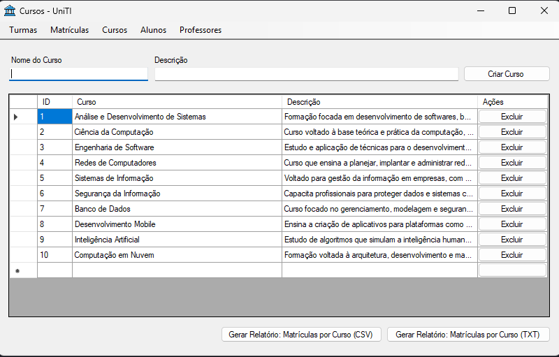

# UniTI Desktop

Esse é um projeto universitário de um sistema de gestão acadêmica desenvolvido em C# com Windows Forms, utilizando 5 padrões de projeto para promover organização, reutilização e manutenção do código.

## Funcionalidades
- Cadastro, edição e exclusão de Alunos, Professores, Cursos, Turmas e Matrículas
- Relatórios de matrículas por curso (exportação em TXT e CSV)
- Interface gráfica amigável para gerenciamento das entidades

## Padrões de Projeto Utilizados
- Command: Para operações de exclusão com suporte a desfazer (Undo)
- Observer: Notificação quando uma turma atinge sua capacidade máxima
- Adapter: Exportação de relatórios em diferentes formatos (TXT e CSV)
- Template Method: Geração de relatórios de matrícula por curso
- Singleton: Gerenciamento de conexão com o repositório de dados

## Estrutura do Projeto
- entities/ - Entidades do domínio (Aluno, Professor, Curso, Turma, Matricula)
- models/ - Modelos e repositórios de dados
- patterns/ - Implementações dos padrões de projeto
- views/ - Telas do sistema (Windows Forms)
- controllers/ - Lógica de controle das telas

## Como Executar
1. Abra o projeto no Visual Studio
2. Compile a solução
3. Execute o projeto (F5)

## Observações
- Os relatórios gerados são salvos na mesma pasta do executável.
- Para testar notificações de capacidade máxima, cadastre alunos em uma turma até atingir o limite definido.

## Licença

Este projeto está licenciado sob a Licença MIT - consulte o arquivo [LICENSE.md](LICENSE.md) para obter detalhes.